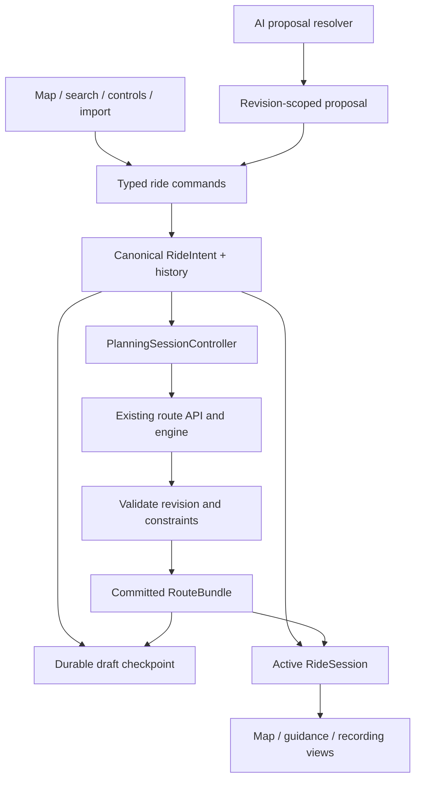

# Architecture assessment

Baseline: `63de8ef583e93a6f323662cfe390febcb8480f60`. Paths below refer to that reviewed snapshot. Production's exact built SHA was not attested; do not equate checkout HEAD with deployed assets.

## Current system and disposition

| System | Current owner/evidence | Assessment and disposition |
|---|---|---|
| Runtime | Next.js route handlers, React 19, TypeScript, single app process | Good fit. Preserve deployment model; no microservices |
| Planner intent | `src/stores/planner-store.ts` plus `PlannerShell.tsx` local mode/time/highway/toll/avoid-area/segment/sketch fields | Fragmented. Rebuild ownership, not the route engine |
| Route geometry | `route-entity-cache.ts`, store summaries, separate navigation references | Useful bounded cache. Preserve large-object separation; add revision integrity and durable last-result storage |
| Request lifecycle | `planning-session-controller.ts`, `trip-planning-coordinator.ts`, `latest-request.ts` | Salvageable and tested. Move module-global abort ownership into the session and key outcomes to full intent revision |
| Routing providers | `/api/routes/route.ts` constructs `createHybridRouteProvider`; GraphHopper primary, eligible Valhalla failure fallback | Preserve. Reviewed runtime path does not implement the ADR's future TomTom federation; do not describe roadmap as shipped |
| Candidate evaluation | `routing/planner*`, normalized request, eligibility, recommendation scoring, diversity | Strong core. Audit evidence semantics and score calibration; no learned ranker |
| Map | `MapStage` selects renderer; shared `PlannerMapStage` owns map, drawing, sculpting, overlays, camera effects | Shared renderer reduces duplication; stage remains broad. Extract lifecycle/gesture/object adapters behind one map |
| Drawing | `map-drawing.ts`, `route-sketch.ts`, `sketch-corridor.ts` | Inference/corridor scoring valuable. Persist raw intent, improve multi-stroke and edit history |
| Points/undo | Store `RoutePointSnapshot` = start/finish/via; `applyRoutePointEdit` invalidates route result | Correctly bounded, but wrong product boundary. Replace with intent-wide transactions |
| Avoid areas | Shell local array; map rectangle creation; options "Remove latest" | Weak. Promote to stable editable constraints with shared history/persistence |
| Preferred roads | Store road locks, matching/satisfaction modules, sculpt handlers | Preserve domain capability. Replace terminology and make lifecycle transactional |
| Navigation | Navigation store, pure session reducer, engine, `useNavigationSessionController`, reroute/recovery libraries | Significant reusable work. Integrate into one active ride session and validate physically |
| Free Ride | Shell refs/reducer + recording hook + `/api/free-ride/suggestions` + graph-backed recommender | Good ahead-only intent, incomplete integration. Rebuild transitions and constraint propagation |
| AI | `advice/*`, `RideAdvisor`, separate `ai/*` intent/research/grounding | Useful provider/resolver seams; incomplete planner context and overlapping product surfaces. One action protocol, retain specialized internal adapters |
| Community/discovery | Discover fetches first 24 community routes; separate project GPX library and `/routes` pages; API comments/revisions/reports | Overextended backend, underconnected consumer workflow. Consolidate sources and derivative handoff before social scope |
| Import/export | Worker client + GPX/KML/KMZ parsers, streaming corpus pipeline, join/intelligence/export | Strong, retain original/derived separation. Reconcile different parser limits and UI entry points |
| Persistence/offline | Dexie libraries, small localStorage planner preferences, recording recovery, service worker, region and corridor workers | Good primitives, incomplete product recovery/readiness. Add atomic draft/session checkpoint and route-specific readiness |
| Responsive/design | Global CSS/token layer + component modules + workspace inset helpers + V2 composition | Salvage identity and primitives; replace task layout instead of adding override layers |
| Tests/release | Vitest; critical Chromium/WebKit; real-router/PWA/visual jobs; mobile QA | Broad assets. Contract-mocking and advisory prose can hide actual failures; require explicit evidence by layer |

## Consequential findings

`PlannerShell.tsx` is 1,818 lines at the baseline. File length is not itself a defect; the concrete problem is that it assembles requests while maintaining route-defining fields in local state and mutation-specific overrides. AI handoff needed explicit values to avoid React state timing races. Every new input method risks repeating that repair.

The store's `partialize` persists saved places, search history, profile, bike profile, road locks, and curvature visibility—but not the active start/finish/via/plan. A page refresh retains fragments of old intent while losing the ride. An exclusion in shell state disappears; a road lock may survive. That is neither a clean reset nor faithful recovery.

Free Ride acceptance and Head Home call `recording.finish()`, replace planner points, and reset highway/toll/area settings. Polling sends `profile: "neural"`, `workload: "normal"`, and an empty recent-candidate list. The API has stronger suppression concepts than the UI currently supplies. This is an integration gap, not proof that the graph algorithm lacks them.

`AdviceRequest` allows `context: null`; `RideAdvisor.ask` sends it pre-route; the endpoint validates an optional object, not null. Live requests with null returned 400. Mocked browser responses bypass this boundary, explaining why a successful UI fixture does not prove a working builder.

AI context has candidates and sampled geometry but no canonical avoid areas, current highway/toll policy, kept spans, selected map object, full bike constraints, or explicit Home. `ProposedRide` replaces a set of planner inputs. It cannot represent a narrow "avoid this area" operation or guarantee preservation of fields it never received. `RouteSecondOpinion.wouldPick` also creates a competing recommendation authority; it does not rewrite the deterministic ranking array, but its user-facing claim needs policy reconciliation.

`computeOfflineReadiness` can mark routing ready because any installed region has a graph, without checking this route's coverage. Service-worker registration is treated as shell readiness, although registration alone does not prove offline reload. Preserve the levels, change the evidence they consume.

## Target ownership

### RideIntent

One serializable versioned value: `rideId`, `revision`, trip shape, start with provenance, optional finish, ordered stops/shaping anchors with stable IDs, time target/return deadline, road/surface preferences, bike constraints, exclusions, kept/preferred directed spans, optional sketch and segment intent. Distinguish user-authored constraints from defaults and inferred values. Store elapsed ride observations elsewhere.

Presentation-only state—sheet detent, hover preview, selected object, map camera, open task, unfinished pointer gesture—does not belong in routing intent or its undo history. Map selection has an object ID and direction/pass reference so AI and direct editing share the same target.

### Commands and proposals

Use a small discriminated union of domain operations: set endpoints/time/preferences, insert/move/remove point, replace sketch/span, create/update/remove exclusion, keep/prefer/remove road span, reverse ride, apply validated proposal. Each command validates against a base revision and yields one new intent plus a history entry. Do not build a generic arbitrary JSON-patch engine or persistent event-sourcing system.

Keep bounded before/after intent snapshots or reversible operations; large immutable sketch/geometry objects are referenced by ID. Start with a 50-entry history and explicit memory limits, then measure realistic drawings. Selection changes do not reroute or fill edit history. AI Apply is one compound command.

### Routing lifecycle

Separate desired draft revision, committed intent/result revision, and pending request. Request identity includes intent revision and planning generation. Primary/alternative results carry the same identity; user selection survives alternatives. The controller owns its abort controller. Server abort reaches queued provider work as today; test running and queued cancellation separately.

Keep last-good geometry while planning. Commit a new bundle only after schema, eligibility, constraint satisfaction, and revision checks pass. If the user cancels, invalidate all descendants, including research/advisor work tied to that draft. A failed proposal does not overwrite committed state. Do not call a failure "success" merely because a handler returned without throwing.

Cache keys must include every route-affecting constraint, direction/pass semantics, region/provider-data versions, and policy version. Cached geometry is not sufficient evidence that new constraints are met. Distinguish an unavailable alternative provider from failure of the required baseline.

### RideSession

One session owns activity (`free`, `guided`, `paused`, `completed`), selected route revision, remaining intent, reliable position/freshness, return target, recording ID, completed stops, recommendation budget, and recovery checkpoint. Recording storage remains specialized; the session refers to it. GPS samples and derived telemetry are not planner commands.

Accept suggestion and Head Home transition the session without terminating the recording. Hard constraints survive. Resume after reload is paused pending fresh GPS and user action. Do not reconstitute Free Ride solely from a recording flag.

### AI protocol

Keep provider transport, capability checks, geocoding, bounded toolbox, and deterministic resolvers. Introduce an explicit read model for full relevant intent plus selected map target. Tools return proposals/evidence, never mutate UI stores. Proposal operations validate capability, reference existence, locality, eligibility, maximum scope, and base revision before preview/application.

Give the model source-scoped evidence: "search returned no POIs within this query/radius," not "there are no stops." Home is a resolved semantic target, not a phrase inferred from route destination. Explain exact selected spans with provenance. Compare numbers deterministically; do not have the model recompute ETA deltas inconsistently.

Use one rider request entry capable of dispatching local interpretation or AI assistance. Keep separate internal interpreters if they serve distinct latency/capability needs, but do not expose multiple rival "describe a ride" experiences. Conversations remain ephemeral; accepted intent is the durable memory.

### Persistence and offline

Store the active draft, last usable bundle, and session checkpoint transactionally in IndexedDB with schema version and integrity references. Avoid synchronous large geometry writes on every GPS sample. Bound/batch recording checkpoints. Use a small localStorage bootstrap pointer only if needed. On corrupt or partial data, restore the last valid checkpoint and preserve exportable originals.

A one-time migration reads existing preferences/road locks and local libraries, records migration completion, and never fabricates a lost draft. Keep old data readable through rollback. Do not remove old keys until the migration and fallback release are proven. Multiple tabs detect revision conflicts and offer reload/copy, rather than last-writer-wins data loss.

Offline readiness must evaluate this route corridor, required graph tiles, map coverage, integrity, schema, and freshness separately. Preserve honest track-only navigation. Mapbox offline availability and licensing need separate current verification before parity claims; no token or renderer migration magically grants offline navigation.

## Refactor boundaries and removal criteria

Add narrow modules under existing planner/client/domain/storage areas. Migrate one operation family at a time, with existing UI calling adapters into the new owner. The adapter may read the canonical intent; it may not become a second writable copy. Delete each legacy setter/history path after its callers and tests are migrated.

Do not rewrite `routing/planner`, import parsers, GPS matching, or provider normalization solely to match a new folder layout. Change their contracts only where necessary to preserve intent/evidence. Retire the MapLibre rollback only after actual Mapbox production/browser/device acceptance; do not turn the migration shim into a permanent renderer framework.
