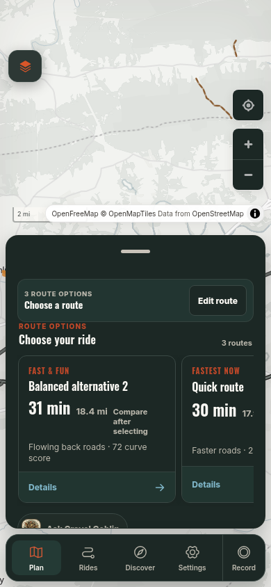
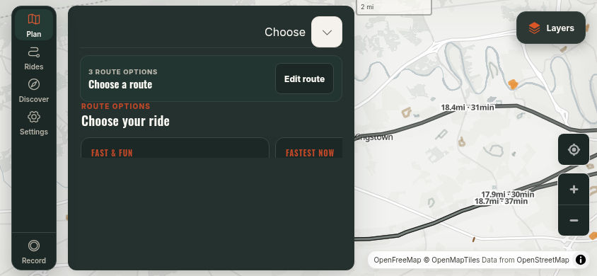
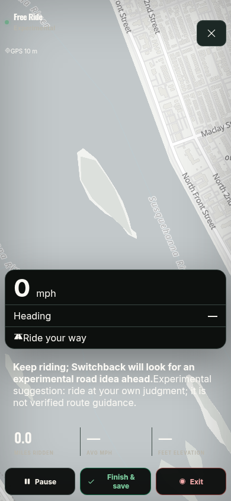
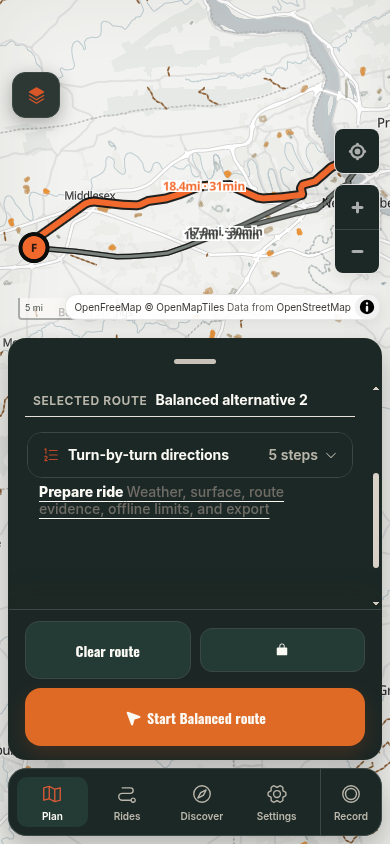
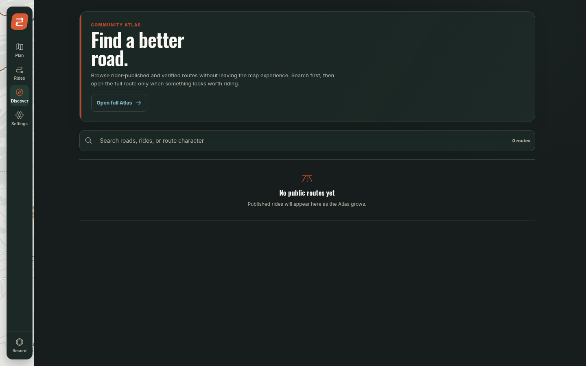

# Switchback UX audit

Review date: 2026-09-05. Source snapshot: `63de8ef583e93a6f323662cfe390febcb8480f60`. Production: `https://ride.henning.rodeo`. Candidate: detached `/tmp/switchback-astra-audit`, local port 3123, Next webpack development mode. Production was running from the original checkout and was restarted by activity outside this audit; its exact built SHA is not attested.

## Verdict

Switchback can produce real, useful motorcycle routes. The surrounding workflow is not yet consistently understandable, reversible, recoverable, or legible. It feels like several capable subsystems sharing a map rather than one intentional ride product. The strongest next investment is coherent state and interaction ownership, followed by complete-screen redesign—not more providers, overlays, or a larger chatbot.

## Evidence discipline

**Observed** means exercised in a browser or a live API probe in this run. **Code** means a reachable implementation or contract was inspected, but the complete live interaction was not proven. **Target gap** means desired functionality is absent from the reviewed contract; it is not a regression claim. **Unverified** is an explicit remaining test boundary.

The production probe completed its scripted navigation/capture steps with no recorded step failures or page errors. That is not a UX pass: it captured serious defects. Its browser GPS was simulated at Harrisburg with 10m accuracy, and service workers were blocked. Therefore these screenshots do not establish physical location, real riding, or offline capability.

The handoff says the probe completed before the architecture consultation; the conversation's execution order differed. Artifact content, not that chronology or a completion checkmark, is used here. The independent Claude consultation produced no review because of a subscription limit.

## Prioritized findings

Severity: **S1** blocks a core job, risks loss of intent, or misleads an important riding decision. **S2** causes repeated friction, ambiguity, or meaningful accessibility failure. **S3** is lower-impact polish. Safety-sensitive S1s remain release blockers even without observed physical harm.

| ID | Severity / evidence | Finding, reproduction, and user impact | Required outcome |
|---|---|---|---|
| U01 | S1 observed + code | Plan Harrisburg → Carlisle, then refresh. Route chooser and unsaved plan disappear. Store persistence excludes active points/result. [After refresh](evidence/prod-after-refresh.png) | Restore exact intent and last usable route, or explicit recoverable failure |
| U02 | S1 observed + code | Start destination-free Free Ride, then refresh. It becomes "Recording paused," losing the Free Ride activity. [Before](evidence/prod-free-ride-phone.png), [after](evidence/prod-free-ride-refresh.png) | Restore same session/activity, paused for safe resume |
| U03 | S1 observed | Ask the pre-route builder for a 90-minute ride. UI reports outside-source failure; live `context:null` request returns 400 `INVALID_ADVISOR_REQUEST`. Endpoint accepts optional object, client sends null | Fix contract and expose truthful errors; real endpoint test |
| U04 | S1 observed | Live "I am getting tired; get me home" says the Quick route gets the rider home in 30 minutes although no Home was supplied | Resolve Home/session return point; never infer destination is Home |
| U05 | S1 code | Free Ride accept/Home handlers finish recording and reset highway, toll, and avoid-area settings | Continuous session; preserve active constraints |
| U06 | S1 observed | At 320×568, route cards and lower actions are clipped/obscured. At 844×390 the workspace shows card headings above a large blank panel, while useful card content is outside its visible region | Height-aware composition with reachable decision/actions |
| U07 | S1 observed | Free Ride white text and secondary telemetry sit directly on a light map, visibly low contrast; the top title/GPS are difficult to read | Opaque, verified-contrast HUD surfaces |
| U08 | S2 observed + code | Eight profiles include Quick/Balanced/Twisty/Scenic/Adventure/Gravel/Avoid Highways/Neural; a second Avoid highways checkbox and bike categories add overlapping rules | Rider intent vocabulary with one control per concept |
| U09 | S2 observed | After routing, all three cards say "Compare after selecting"; the setup says "Choose a route." No selected recommendation/commit action appears in the captured default result | Select Best ride and display fastest comparison immediately |
| U10 | S2 observed | "Balanced alternative 2," "Quick route," and "Twisty alternative 2" expose generation names; "Fast & Fun/Fastest Now/Maximum Twisties" add another naming system | Roles + useful distinguishing road/geography |
| U11 | S2 observed | Multiple headings repeat Route options/Choose route/Choose ride. On phones this displaces the route itself; displayed geometry can be hidden beneath the result sheet | One hierarchy and route-aware camera insets |
| U12 | S2 observed | Details opens another disclosure labeled Prepare ride; opening it reveals weather, quality, reasons, multi-day staging, rating, private sharing, publishing, save, and export | Compact relevant preparation; contextual secondary actions |
| U13 | S2 observed | Road-lock button appears as a padlock without visible explanation. Save/export require digging through preparation; Clear route is unusually prominent | Labeled Keep roads action; concise route menu |
| U14 | S1 code | "Undo route edit" only restores start/finish/via; preferences, areas, mode, sketch corridor, and road locks are outside its history | Intent-wide transaction history |
| U15 | S2 code | Area creation makes a rectangle; options only exposes Remove latest. No selected-area vertex/move/edit workflow found | First-class area object editing/deletion/undo |
| U16 | S2 code | New pointer-down resets the drawing to a new stroke; Undo drops one sampled point; Done clears the sketch before routing outcome is known | Stroke/segment history and failure-preserved drawing |
| U17 | S2 code | `routeIntentFromSketch` uses `input.start ?? first` even without an existing route. An automatically seeded start can override the gesture's beginning | Distinguish inferred vs authored endpoints |
| U18 | S1 observed + code | Ten routed AI prompts return prose and no proposed route/stop; several redirect to twisty instead of the requested mutation | Typed narrow proposals with state-aware preview/Apply |
| U19 | S1 observed | AI equates 0% mapped unpaved with pavement and empty stop lookup with no mapped coffee/food. Inputs do not establish complete surface or POI coverage | Scope every claim to evidence coverage; unknown stays unknown |
| U20 | S2 observed | AI exposes internal route IDs and implementation language; repeated preference for perfect curve score substitutes for rider intent | Deterministic metric rendering; grounded plain-language rationale |
| U21 | S2 observed | Discover shows zero public routes and a large empty marketing-like surface while the separate project catalog returns 537 routes | Source-aware discovery with useful curated/import fallback |
| U22 | S2 code | Discovery filters only the first 24 community records client-side. Detail's Plan your own route links to `/` rather than a derivative | Real search/pagination and Use this ride handoff |
| U23 | S1 code | Offline readiness can say routing ready based on any downloaded graph, not this ride's spatial coverage | Route-specific map/track/reroute readiness |
| U24 | S1 code / field unverified | Free Ride sends normal workload and neural profile, without rider character or recent traversal state; fixed polling can miss the initial fix until a later interval | Real session inputs, quiet defaults, actionable availability |
| U25 | S2 observed | First-run map is national-scale; routing coverage and actual origin are not clear in the composer | Visible start provenance and region availability |
| U26 | S2 code | Main prompt and Goblin both invite natural ride requests but have different capabilities, contracts, and error behavior | One understandable request surface; specialized internals allowed |
| U27 | S2 observed/code | Healthy API/capability checks and mocked AI builder tests coexist with the null-context production failure | Client-to-real-handler contract coverage |

## Complete-screen evidence

### Route choice, phone and short landscape

The phone view leaves the recommendation unselected, repeats headings, and clips the advisor at the bottom. The landscape panel spends substantial space on chrome and blank area while the cards are cut off. These are complete-screen defects, not acceptable consequences of a passing viewport-bounds assertion.

### Riding readability

The main speed panel is legible, but status/instructions outside it are not protected from the daylight basemap. More warning copy does not make the riding experience safer or clearer.

### Preparation and discovery

Preparation is hidden under multiple disclosure layers, while Discover uses a large authored introduction to display no rides. The application already has a catalog; the source split is a product problem to solve explicitly.

Other captured sizes: [320×568](evidence/prod-route-tiny-phone.png), [430×932](evidence/prod-route-large-phone.png), [768×1024](evidence/prod-route-tablet.png), [1440×900](evidence/prod-route-desktop.png), [2560×1080](evidence/prod-route-wide-desktop.png). These are Chromium captures, not physical device certification. Map labels also overlap on shared candidate geometry in the details/landscape captures.

## Live AI prompt results

Full responses and elapsed times: [advisor-live-probes.json](evidence/advisor-live-probes.json). First two requests used no route (`context:null`) and a Harrisburg origin. Remaining ten used captured real Harrisburg → Carlisle candidate metrics and 40 sampled coordinates, no conversation history, no Home, and no selected map span. These were live endpoint probes; they do not claim every response was exercised through an Apply UI.

| Request | Actual result | Assessment |
|---|---|---|
| Fun 90-minute ride | 400 invalid request | Pre-route contract broken |
| Somewhere scenic | 400 invalid request | Same contract failure |
| No highways | Recommends Twisty; no mutation | Does not enact avoidance |
| Mostly pavement/easy dirt | Says no reliable unpaved connectors; recommends Twisty | No difficulty evidence or mutation |
| Make twistier | Recommends existing Twisty | Comparison prose, no changed intent |
| Tired/get home | Claims Quick gets home in 30m | Unsupported Home assumption |
| Another option | Recommends existing Twisty | Does not generate a distinct option |
| Why this section | Explains whole candidate set and exposes internal ID | No selected-span grounding |
| Avoid that area | Admits ambiguity, then recommends Twisty | Should request area selection; no avoidance |
| Keep road/change rest | Says it cannot edit geometry; recommends Twisty | Unsupported command surface |
| Extend an hour | Says rider must find own detour | No duration mutation |
| Interesting stop | Claims nothing mapped for coffee/food; no stops | Empty-search overclaim |

All ten routed responses were `status:ok`, with no proposed ride and no proposed stops. Their elapsed response times were approximately 3.2–8.2 seconds in this run; this is a small sample, not a latency percentile. Several responses contradicted one another about the rounded time difference. Arithmetic should be rendered from structured values.

## Coverage ledger and honest limits

| Requested area | Evidence completed | Remaining boundary |
|---|---|---|
| Choose start/destination/calculate | Production UI Harrisburg → Carlisle, real provider responses | Wider ADV route-quality corpus and rider appraisal |
| Select route/details | Production UI selected/opened Balanced details | Systematic selection/preview across renderers |
| Add/remove/reorder/drag points; preferences/highways | Source trace; candidate planning tests passed, broader edit journey stopped at helper/selector failures | Full live manipulation matrix, all modes |
| Avoid roads/areas/edit/delete/undo/redo | Reachable controls and implementation inspected | Individual live object edits and compound undo failures |
| Save/share/export | Production Save route, Copy private link, Export GPX controls invoked in isolated audit browser | Download contents, link destination/privacy round-trip not verified by those clicks alone |
| Drawing | Production Draw opened; inference/history/corridor code inspected; candidate corridor test rendered three choices before failing a naming assertion | Full edit/undo sequence and messy multi-stroke/double-back/crossing tactile behavior unverified |
| Free Ride | Destination-free start, simulated GPS, phone/desktop capture, refresh | Real moving suggestion, extension/character/turn-around not established; absent controls are target gaps |
| AI | Candidate UI failure + twelve live endpoint prompts; schema traced | Applied live proposal, voice/motion behavior, new protocol correctness |
| Discover/library | Production zero public routes, 537 catalog records, Rides opened, Back/Forward visited | Publish, authenticated remix, attribution round-trip, comments, private sync not exercised |
| Geolocation denied/GPS lost | Candidate suite has denial fixture; navigation code inspected | Actual device permission and loss/reacquisition |
| Delayed/failed/rapid requests | Critical candidate tests passed against intercepted services | Live provider cancellation timing/load and all gestures |
| Refresh/back/forward | Production captures for planning, Free Ride, Discover navigation | Cross-tab and corrupt-storage recovery |
| Network/offline | Service worker/readiness code, candidate offline fixtures | Service workers blocked in production probe; airplane-mode rerouting not tested |
| GPX/KML/KMZ | Parser/worker/limits and original/derived boundaries read; focused GPX unit tests | Malformed/large file browser responsiveness, device import, archive adversaries |
| Responsive | Seven route viewports + phone/desktop Free Ride and details | Real Safari/WebKit, tablet touch, keyboard, 200% text, sunlight/gloves |

The initial eight-file focused Vitest run passed **65 tests**. That covers planner store/session, sketch inference, sculpt reducer, advisor handoff/adversaries, GPX import, and Free Ride API. Candidate Playwright finished **28 passed / 6 failed / 0 skipped**. First triage found accessible-name and helper/state expectation drift; downstream assertions in those six tests did not complete. See [ASTRA-STATE](ASTRA-STATE.md) for details and environment limitations. No passing release is implied.

## What this audit does not claim

It does not claim exhaustive line-by-line repository review, all requested live interactions completed, full release checks passing, physical motorcycle navigation verified, Mapbox production parity, or an independent review completed. The current evidence is enough to define a coherent refactor and identify blockers. Remaining verification is explicitly scheduled in wave 0 and the release gates rather than silently marked complete.
