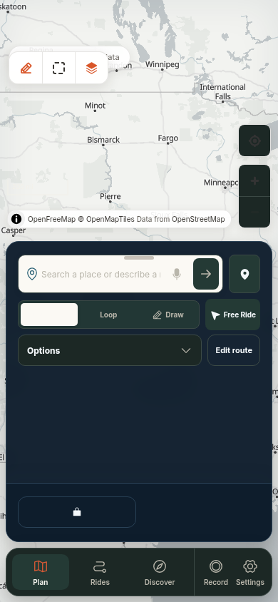
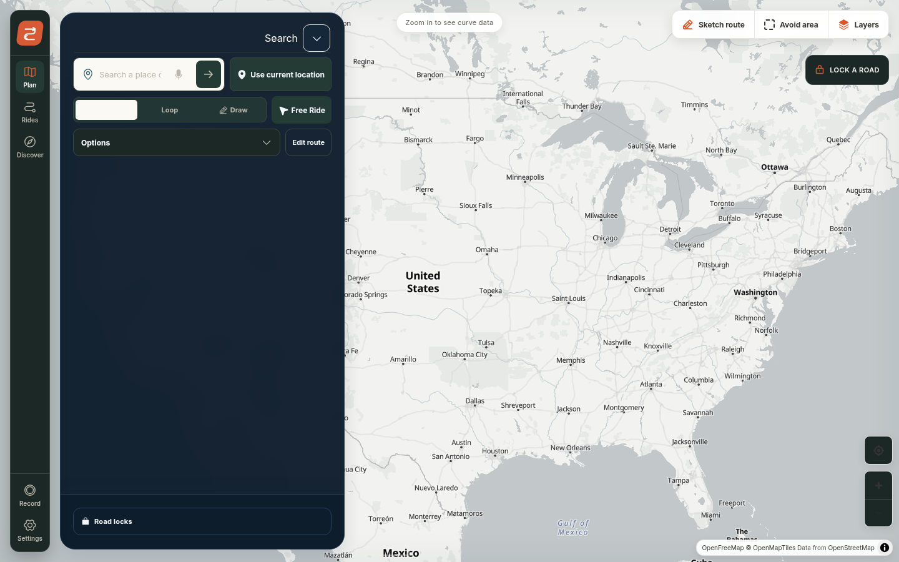

# Switchback UX V2 — Phase 2 checkpoint

This branch is an intentionally reviewable checkpoint of the Phase 2 plan-composer work. It is pushed for follow-up, not presented as a release-ready UX pass.

## Branch and base

- Branch: `ux/v2-phase-2-plan-composer`
- Base: `9b6f521` (`docs: record Switchback V2 product and visual authority`)
- Upstream V2 integration branch: `hermes/switchback-ux-v2-planning-package-20260830-042301-6d0994c4`
- Source package: `switchback-ux-v2-planning-package.zip`

## What is included

- Compact V2 `Destination | Loop | Draw` composer shell.
- Exact idle prompt: `Search a place or describe a ride`.
- Progressive Options panel for route profile, bike profile, timing, waypoints, and route constraints.
- V2 typography/token stylesheet wiring and component tests.
- Critical planner journey test updates for the new composer selectors.
- Product and visual authority notes in [`PRODUCT.md`](../../PRODUCT.md) and [`DESIGN.md`](../../DESIGN.md).

## Known blockers to fix before merge

These findings came from the independent spec/standards review and the rendered browser pass. They are deliberately recorded here so the next pass does not mistake green unit/build checks for UX completion.

1. **Draw is not a real V2 stroke workflow.** The current entry point uses a global `.map-sketch-button` DOM click bridge. It does not yet provide the contract-required endpoint/near-closed-loop inference and `Undo / Clear / Done / Cancel` toolbar. The direct typed map command/state seam belongs in the next pass.
2. **Idle mobile geometry is over budget.** At 390×844, the composer measured 156px (the contract is ≤140px). The desktop composer measured 158px. Options and route editing must converge to one disclosure surface.
3. **Idle controls are duplicated.** `Options` and `Edit route` toggle the same state, and `Road locks` remains persistently exposed in the dock even though it belongs inside Options for the idle state.
4. **Destination's selected label is not legible in the rendered theme.** The semantic `aria-pressed` state exists, but the active visual treatment needs a real screenshot-level fix.
5. **Touch targets regress below the 44px product floor.** Several mode, search, and Options controls use 32–40px dimensions.
6. **Prompt submission needs its in-flight guard restored.** The V2 path currently permits another submit while intent interpretation is active.
7. **The old V1 composer remains as a large unreachable `{false ? ...}` branch**, along with stale rotating-example state/effects. It should be retired rather than masked.
8. **Loop timing is missing the required `Custom` option.**
9. `next-env.d.ts` contains generated `.next/dev` reference churn and should be restored unless the repository generator requires it.

## Rendered evidence

These screenshots are from the current branch before the blockers above are repaired. They are intentionally included as review evidence.

### Mobile — 390×844



The screenshot shows the invisible selected Destination label, the over-tall composer, and the duplicate `Options` / `Edit route` controls.

### Desktop — 1440×900



The desktop render shows the same duplicated idle controls and the old road-lock dock competing with the primary composer.

## Verification at checkpoint

Fresh checks on this exact branch:

```text
npm exec vitest run tests/components/plan-composer.test.tsx tests/components/plan-options.test.tsx tests/components/planner-deck.test.tsx
49 tests passed

npm run lint
passed with --max-warnings=0

npm run typecheck
passed

npm run build
passed (Next.js 16.3.0)
```

The critical Chromium planner journey suite was also run against the existing dev server with `SWITCHBACK_E2E_URL=http://127.0.0.1:3122`: **12 passed**. That validates reachable planner/routing behavior, not the visual contract; the blockers above remain open and the full target viewport matrix still needs to be rerun after repair.

## Suggested next pass

Start with the Draw command seam and compact idle geometry, then remove the masked V1 branch and restore submission locking. Re-run the Phase 2 component suite, critical Chromium journeys, and the 390×844 / 1440×900 screenshot checks before considering the branch mergeable.
